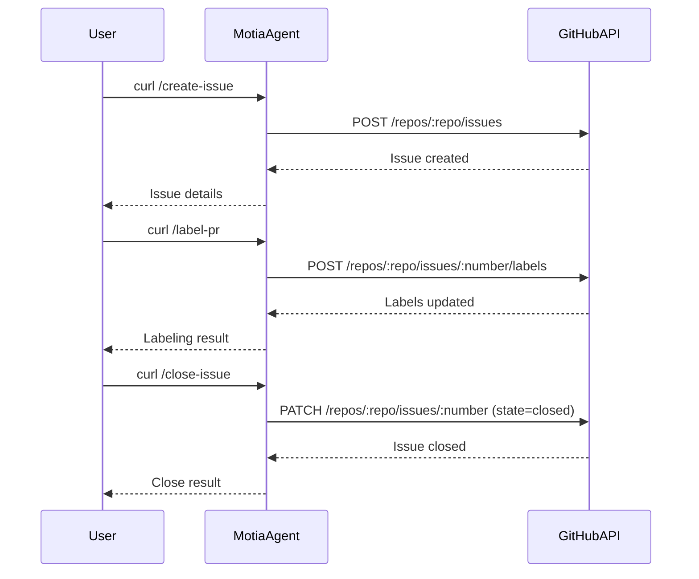

# GitHub PR Agent


A powerful and intelligent agent for managing and automating GitHub Pull Requests and Issues, built with [Motia](https://motia.dev). This tool helps streamline code review, automate issue management, and enhance collaboration in software development teams.

---

## 🚀 Quickstart (5 Minutes)

1. **Clone the repository:**
   ```bash
   git clone https://github.com/swarna1101/github-pr-agent.git
   cd github-pr-agent
   ```
2. **Install dependencies:**
   ```bash
   pnpm install
   ```
3. **Configure environment:**
    - Copy `.env.example` to `.env`
    - Fill in your GitHub token and repo:
      ```env
      GITHUB_TOKEN=your_github_token_with_repo_or_issues_scope
      GITHUB_REPO=owner/repo-name
      ```
4. **Start Motia:**
   ```bash
   pnpm dev
   ```
5. **Try the API!** (see curl commands below)

---

## 🛠️ Example API Usage (curl)

### List Open PRs
```bash
curl http://localhost:3000/list-prs
```

### Get PR Details
```bash
curl "http://localhost:3000/get-pr-details?number=123"
```

### Label a PR
```bash
curl -X POST http://localhost:3000/label-pr \
  -H "Content-Type: application/json" \
  -d '{"number":123,"labels":["triage","needs-review"]}'
```

### Auto Assign Reviewers
```bash
curl -X POST http://localhost:3000/auto-assign-reviewers \
  -H "Content-Type: application/json" \
  -d '{"number":123}'
```
This endpoint automatically:
- Assigns @swarna1101 as a reviewer for all PRs
- Analyzes changed files to identify relevant teams
- Requests reviews from team members based on file patterns
- Returns the list of assigned reviewers and teams

### Create an Issue
```bash
curl -X POST http://localhost:3000/create-issue \
  -H "Content-Type: application/json" \
  -d '{"title":"Test Issue from Motia","body":"This issue was created via the Motia API.","labels":["bug"]}'
```

### Close an Issue
```bash
curl -X POST http://localhost:3000/close-issue \
  -H "Content-Type: application/json" \
  -d '{"number":123}'
```

### Update Issue Details
```bash
curl -X POST http://localhost:3000/update-issue \
  -H "Content-Type: application/json" \
  -d '{"number":2,"body":"This issue was created by Motia.\n\nHere are more details:\n- This is a demo update\n- Motia can automate GitHub\n- You can add more lines\n- Use this for any workflow\n- Enjoy automation!"}'
```

---

## 📊 Sequence Diagram



---

## 🤖 Why Motia?

- **Visual Automation:** Motia lets you visually design, connect, and automate workflows for GitHub and beyond.
- **Low-Code:** Add new steps and flows with minimal code.
- **Extensible:** Easily add new endpoints, triggers, and integrations.
- **Observability:** Built-in logs and state tracking for debugging and auditing.
- **Fast Prototyping:** Build, test, and iterate on automations in minutes.

Motia is perfect for teams who want to:
- Automate repetitive GitHub tasks (labeling, triage, notifications)
- Build custom bots and integrations
- Prototype workflow automations visually

Learn more: [motia.dev](https://motia.dev)

---

## 🌱 Future Work
- **Auto-label PRs based on content or author**
- **PR review assignment automation**
- **Slack/Discord notifications for PR/issue events**
- **Scheduled/recurring GitHub actions**
- **Custom triggers (e.g., on PR opened/closed/merged)**
- **Integration with CI/CD and other tools**
- **Webhooks for real-time event handling**

---
